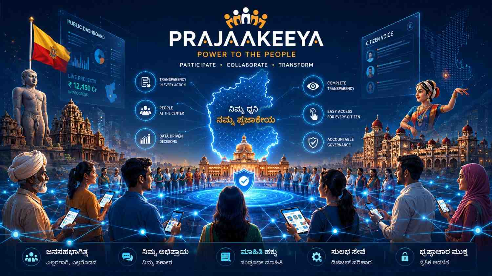
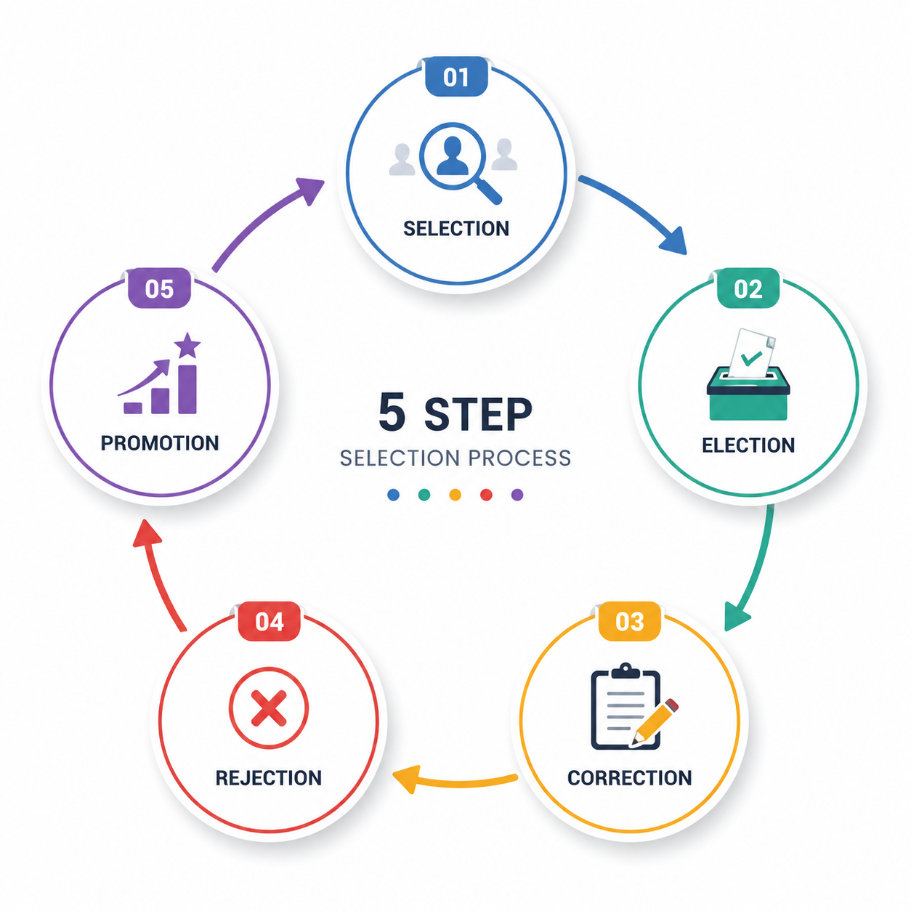
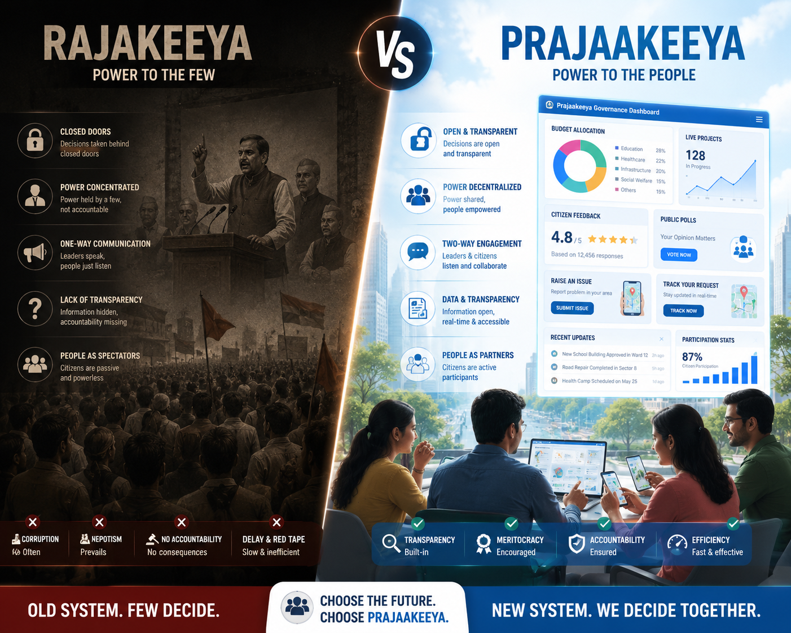
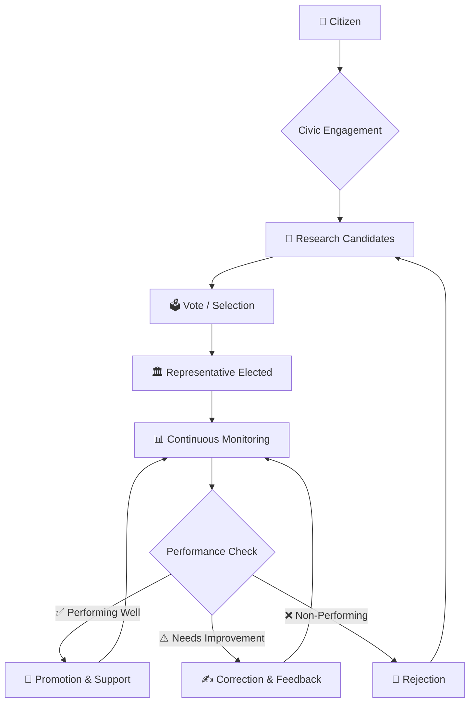
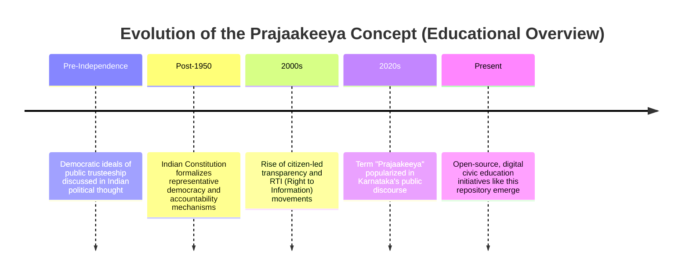
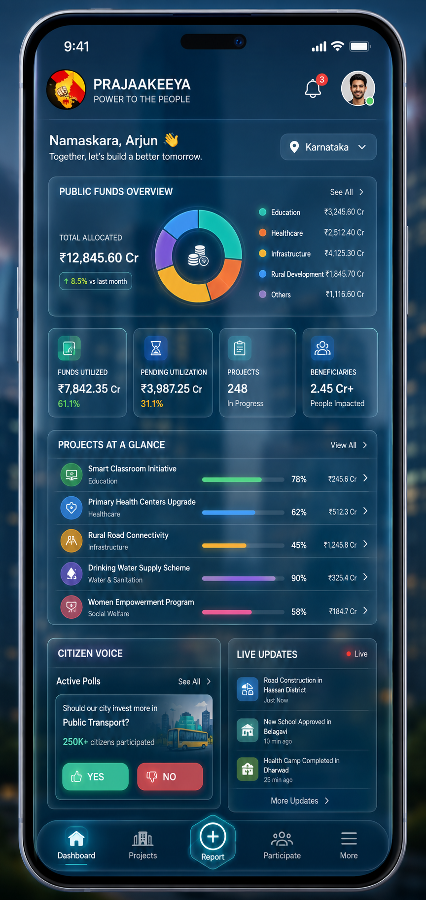
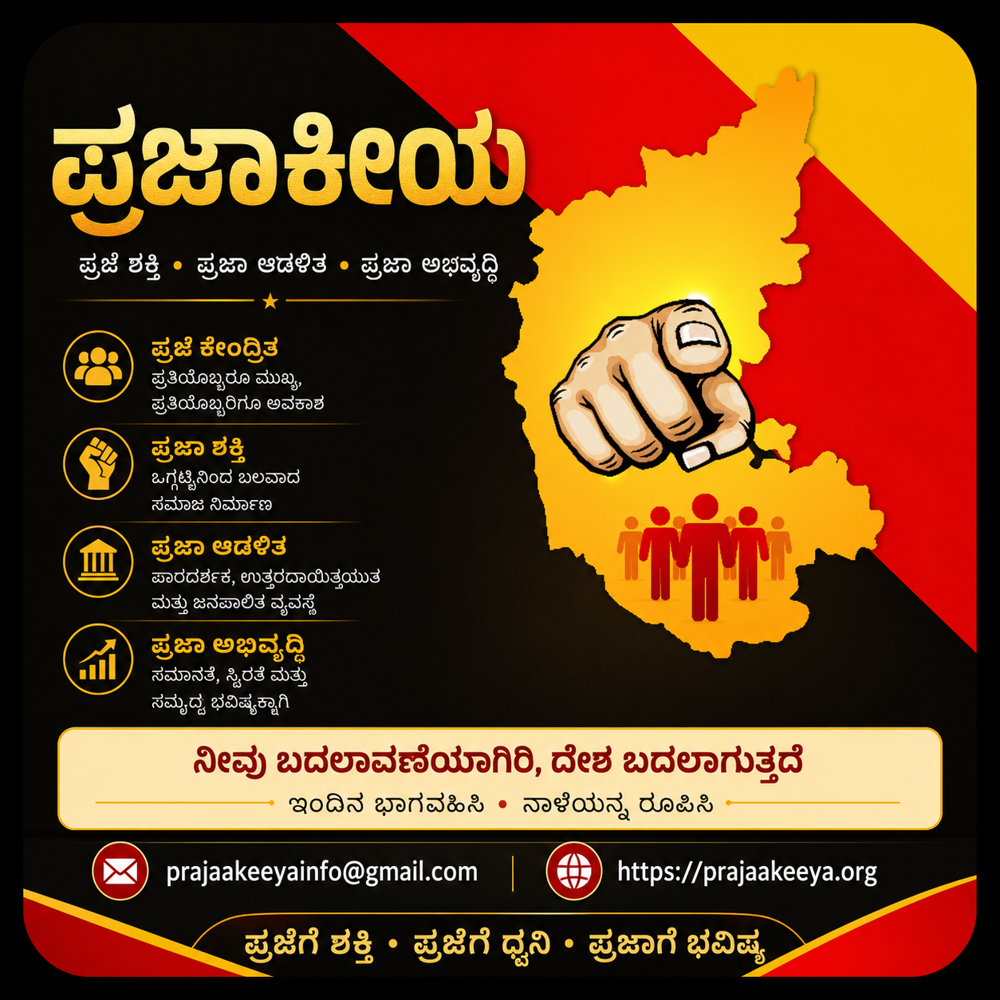

<h1 align="center">PRAJAAKEEYA | ಪ್ರಜಾಕೀಯ</h1>

<p align="center">
  <strong>"ಪ್ರಜೆಗಳೇ ನಾಯಕರು | People are the real leaders"</strong>
</p>

<p align="center">
  An open-source, educational initiative explaining citizen-centered governance —
  rooted in accountability, transparency, and participatory democracy.
</p>

<p align="center">
  
  
  
  
  
  
</p>

<p align="center">
  <em>📘 Educational • 🤝 Politically Neutral • 🌍 Open Source • 📱 Mobile Friendly</em>
</p>

---

## 📌 Mission Statement

**PRAJAAKEEYA (ಪ್ರಜಾಕೀಯ)** exists to educate citizens — in both **English** and **ಕನ್ನಡ** — about
the concept of people-centered governance. This repository is a **neutral, research-based,
open-source knowledge base**. It does not promote any political party, individual, or
ideology. It exists purely to explain civic concepts such as accountability, responsibility,
transparency, citizen participation, and ethical governance in a structured, accessible way.

> ⚠️ **Disclaimer:** This project is strictly educational and informational. It contains no
> propaganda, no endorsements, and no unverified claims. All content is written for
> learning purposes only.

---

<div align="center">
  
</div>

---

## 🔗 Quick Links

<div align="center">

| 🌐 Website | 🤖 Play Store | 🍎 App Store | 💻 GitHub |
|:---:|:---:|:---:|:---:|
| [Visit Site](https://www.prajaakeeya.org/) | [Get it on Android](https://play.google.com/store/apps/details?id=com.app.prajaakeeya) | [Get it on iOS](https://apps.apple.com/in/app/the-real-prajaakeeya/id1316882222) | [View Source](github.com/prajaakeeya) |

| 📢 Telegram | ▶️ YouTube | 💼 LinkedIn | 📷 Instagram | 🐦 Twitter/X | 💬 Discord |
|:---:|:---:|:---:|:---:|:---:|:---:|
| [Join](#) | [Subscribe](#) | [Connect](#) | [Follow](https://www.instagram.com/prajaakeeya_upp?igsh=MXB6aTJib2w1eDhneQ==) | [Follow](#) | [Join Server](#) |

</div>

---

## 🇬🇧 What is Prajaakeeya?

**Prajaakeeya** is a civic philosophy term combining two Kannada words: *Praje* (ಪ್ರಜೆ —
citizen/people) and *Rajakeeya* (ರಾಜಕೀಯ — politics/governance). Together, it represents a
governance model where **citizens are placed at the center of political accountability**,
as opposed to traditional top-down power structures.

The concept gained public attention in Karnataka through discussions led by actor-politician
**Upendra**, who used it as a framework to describe a governance system driven by public
participation rather than concentrated political authority. This repository documents the
**concept itself** — academically and neutrally — without endorsing any individual, party,
or movement.

### Origin in Karnataka

The term emerged from Karnataka's contemporary political discourse as an alternative framing
to conventional party politics. It draws on long-standing democratic ideals — that elected
representatives are *trustees* of public power, not owners of it — and re-frames them into a
simplified, communicable model for everyday citizens.

### Role of Upendra

Upendra is credited with popularizing the term in mainstream Kannada political conversation
and presenting it as a structured five-stage civic model (explained below). This repository
references his framing **only as a historical/educational origin point**, not as a political
endorsement.

---

## 🇮🇳 ಪ್ರಜಾಕೀಯ ಎಂದರೇನು?

**ಪ್ರಜಾಕೀಯ** ಎಂಬುದು "ಪ್ರಜೆ" (ನಾಗರಿಕ) ಮತ್ತು "ರಾಜಕೀಯ" (ಆಡಳಿತ) ಎಂಬ ಎರಡು ಪದಗಳ ಸಂಯೋಜನೆ. ಇದು ಸಾಂಪ್ರದಾಯಿಕ
ಮೇಲಿಂದ-ಕೆಳಗಿನ ಅಧಿಕಾರ ರಚನೆಗೆ ಬದಲಾಗಿ, **ನಾಗರಿಕರನ್ನು ರಾಜಕೀಯ ಹೊಣೆಗಾರಿಕೆಯ ಕೇಂದ್ರದಲ್ಲಿ** ಇರಿಸುವ ಒಂದು
ಆಡಳಿತ ತತ್ವವಾಗಿದೆ.

ಈ ಪರಿಕಲ್ಪನೆಯು ಕರ್ನಾಟಕದಲ್ಲಿ ನಟ-ರಾಜಕಾರಣಿ **ಉಪೇಂದ್ರ** ಅವರ ಚರ್ಚೆಗಳ ಮೂಲಕ ಸಾರ್ವಜನಿಕ ಗಮನ ಸೆಳೆಯಿತು.
ಈ ರೆಪೊಸಿಟರಿ ಯಾವುದೇ ವ್ಯಕ್ತಿ, ಪಕ್ಷ ಅಥವಾ ಚಳುವಳಿಯನ್ನು ಬೆಂಬಲಿಸದೆ, ಕೇವಲ ಪರಿಕಲ್ಪನೆಯನ್ನು ಶೈಕ್ಷಣಿಕವಾಗಿ
ಮತ್ತು ತಟಸ್ಥವಾಗಿ ದಾಖಲಿಸುತ್ತದೆ.

---

## 🧭 Core Principles

<div align="center">
  
</div>

| Principle | English | ಕನ್ನಡ |
|---|---|---|
| 🛡️ **Accountability** | Representatives must answer for their decisions and actions to the citizens they serve. | ಪ್ರತಿನಿಧಿಗಳು ತಮ್ಮ ನಿರ್ಧಾರ ಮತ್ತು ಕ್ರಿಯೆಗಳಿಗೆ ನಾಗರಿಕರಿಗೆ ಉತ್ತರದಾಯಿಯಾಗಿರಬೇಕು. |
| 🎯 **Responsibility** | Power comes with a duty to act in the public interest, not personal gain. | ಅಧಿಕಾರವು ಸಾರ್ವಜನಿಕ ಹಿತಾಸಕ್ತಿಗಾಗಿ ಕಾರ್ಯನಿರ್ವಹಿಸುವ ಕರ್ತವ್ಯವನ್ನು ಒಳಗೊಂಡಿರುತ್ತದೆ. |
| 🔍 **Transparency** | Governance processes, funds, and decisions should be open to public scrutiny. | ಆಡಳಿತ ಪ್ರಕ್ರಿಯೆಗಳು, ನಿಧಿಗಳು ಮತ್ತು ನಿರ್ಧಾರಗಳು ಸಾರ್ವಜನಿಕ ಪರಿಶೀಲನೆಗೆ ಮುಕ್ತವಾಗಿರಬೇಕು. |
| 🗳️ **Citizen Participation** | Citizens engage continuously — not just at elections — in shaping governance. | ನಾಗರಿಕರು ಕೇವಲ ಚುನಾವಣೆಯ ಸಮಯದಲ್ಲಿ ಮಾತ್ರವಲ್ಲದೆ, ನಿರಂತರವಾಗಿ ಆಡಳಿತದಲ್ಲಿ ಭಾಗವಹಿಸಬೇಕು. |
| ⚖️ **Ethical Governance** | Decisions are guided by fairness, integrity, and long-term public welfare. | ನಿರ್ಧಾರಗಳು ನ್ಯಾಯ, ಪ್ರಾಮಾಣಿಕತೆ ಮತ್ತು ದೀರ್ಘಕಾಲೀನ ಸಾರ್ವಜನಿಕ ಕಲ್ಯಾಣದಿಂದ ಮಾರ್ಗದರ್ಶಿಸಲ್ಪಡುತ್ತವೆ. |
| 💻 **Digital Governance** | Technology is used to make governance more accessible, traceable, and efficient. | ಆಡಳಿತವನ್ನು ಹೆಚ್ಚು ಸುಲಭ, ಪತ್ತೆಹಚ್ಚಬಲ್ಲ ಮತ್ತು ಪರಿಣಾಮಕಾರಿಯಾಗಿಸಲು ತಂತ್ರಜ್ಞಾನವನ್ನು ಬಳಸಲಾಗುತ್ತದೆ. |

---

## 🪜 The 5-Step Citizen Model

<div align="center">
  
</div>

```
   1️⃣ Selection
        ↓
   2️⃣ Election
        ↓
   3️⃣ Correction
        ↓
   4️⃣ Rejection
        ↓
   5️⃣ Promotion
```

<details>
<summary><strong>📖 Click to expand: Explanation of each step</strong></summary>

| Step | English Explanation | ಕನ್ನಡ ವಿವರಣೆ |
|---|---|---|
| **1. Selection** | Citizens identify and evaluate potential candidates based on merit, integrity, and vision before any vote is cast. | ಮತ ಚಲಾಯಿಸುವ ಮೊದಲು, ಅರ್ಹತೆ ಮತ್ತು ಪ್ರಾಮಾಣಿಕತೆಯ ಆಧಾರದ ಮೇಲೆ ನಾಗರಿಕರು ಅಭ್ಯರ್ಥಿಗಳನ್ನು ಗುರುತಿಸುತ್ತಾರೆ. |
| **2. Election** | The formal democratic process of voting selected candidates into office. | ಆಯ್ಕೆಯಾದ ಅಭ್ಯರ್ಥಿಗಳನ್ನು ಅಧಿಕಾರಕ್ಕೆ ತರುವ ಔಪಚಾರಿಕ ಪ್ರಜಾಪ್ರಭುತ್ವ ಮತದಾನ ಪ್ರಕ್ರಿಯೆ. |
| **3. Correction** | Ongoing citizen feedback and oversight to course-correct elected representatives during their term. | ಅಧಿಕಾರಾವಧಿಯಲ್ಲಿ ಪ್ರತಿನಿಧಿಗಳ ಕಾರ್ಯವನ್ನು ಸರಿಪಡಿಸಲು ನಿರಂತರ ನಾಗರಿಕ ಪ್ರತಿಕ್ರಿಯೆ ಮತ್ತು ಮೇಲ್ವಿಚಾರಣೆ. |
| **4. Rejection** | The right and mechanism for citizens to reject non-performing or unethical representatives. | ಕಾರ್ಯನಿರ್ವಹಿಸದ ಅಥವಾ ಅನೈತಿಕ ಪ್ರತಿನಿಧಿಗಳನ್ನು ತಿರಸ್ಕರಿಸುವ ನಾಗರಿಕರ ಹಕ್ಕು ಮತ್ತು ವ್ಯವಸ್ಥೆ. |
| **5. Promotion** | Recognizing and supporting representatives who genuinely serve public interest, encouraging continued ethical leadership. | ನಿಜವಾಗಿಯೂ ಸಾರ್ವಜನಿಕ ಹಿತಾಸಕ್ತಿಗೆ ಸೇವೆ ಸಲ್ಲಿಸುವ ಪ್ರತಿನಿಧಿಗಳನ್ನು ಗುರುತಿಸಿ ಬೆಂಬಲಿಸುವುದು. |

</details>

---

## ⚖️ Rajakeeya vs Prajaakeeya — A Comparison

<div align="center">
  
</div>

| Aspect | 🏛️ Rajakeeya (ರಾಜಕೀಯ) | 🧑‍🤝‍🧑 Prajaakeeya (ಪ್ರಜಾಕೀಯ) |
|---|---|---|
| **Leadership** | Power concentrated in elected officials/parties | Power distributed, citizens act as co-stakeholders |
| **Public Role** | Citizens mainly observe and vote periodically | Citizens actively monitor and participate continuously |
| **Transparency** | Often limited or selectively disclosed | Open, continuous access to information emphasized |
| **Accountability** | Primarily through periodic elections | Through real-time feedback and ongoing review |
| **Decision Making** | Top-down, centralized | Collaborative, citizen-informed |
| **Citizen Participation** | Largely passive between elections | Active and continuous engagement |

> 📝 **Note:** This comparison represents conceptual/theoretical framing for educational
> discussion, not a factual claim about any specific government, party, or administration.

---

## 🔄 Citizen Flow Diagram



---

## 🕰️ Timeline



---

## 📊 Governance Dashboard (Concept)

<div align="center">
  
</div>

A conceptual digital governance dashboard could enable:

- 💰 **Public Fund Tracking** — Visualizing how public budgets are allocated and spent.
- 🗳️ **Citizen Voting** — Lightweight polling on local civic issues and project priorities.
- 🏗️ **Project Tracking** — Real-time status of public infrastructure and welfare projects.
- 🔍 **Transparency Layer** — Open data feeds connecting citizens to verifiable government records.

> This is a **conceptual/educational illustration** of how digital governance tools could
> function — not a live or operational product.

---

## 🖼️ Educational Poster

<div align="center">
  
</div>

---

## ❓ Frequently Asked Questions

See the full [FAQ.md](FAQ.md) for detailed answers. Quick highlights:

<details>
<summary><strong>Is Prajaakeeya a political party?</strong></summary>
No. Prajaakeeya is a civic governance concept, not a political party or organization.
</details>

<details>
<summary><strong>Is this repository affiliated with any politician?</strong></summary>
No. This is an independent, open-source educational project. Mentions of public figures are
for historical/academic context only.
</details>

<details>
<summary><strong>Can I contribute translations?</strong></summary>
Yes! See <a href="CONTRIBUTING.md">CONTRIBUTING.md</a> — translators are very welcome.
</details>

---

## 🤝 Contributing

We welcome contributions from:

- 👨‍💻 **Developers** — improve diagrams, automate content checks, build accessibility tools
- 🎨 **Designers** — refine visual assets, posters, and dashboard mockups
- ✍️ **Writers** — improve clarity, structure, and educational tone
- 🌐 **Translators** — expand Kannada/English accuracy and add new languages
- 🔬 **Researchers** — verify facts, add citations, strengthen academic rigor

Please read our [CONTRIBUTING.md](CONTRIBUTING.md) and [CODE_OF_CONDUCT.md](CODE_OF_CONDUCT.md)
before submitting a pull request.

---

## 🗺️ Project Roadmap

See [ROADMAP.md](ROADMAP.md) for upcoming milestones.

## 🔐 Security

See [SECURITY.md](SECURITY.md) for our responsible disclosure policy.

## 📜 Changelog

See [CHANGELOG.md](CHANGELOG.md) for version history.

---

## 📄 License

This project is licensed under the **MIT License** — see [LICENSE](LICENSE) for details.

---

## 🔎 SEO Metadata

<details>
<summary><strong>Click to view SEO tags used for this repository</strong></summary>

```html
<title>PRAJAAKEEYA | ಪ್ರಜಾಕೀಯ — Citizen-Centered Governance Education</title>
<meta name="description" content="An open-source, bilingual (English/Kannada) educational repository explaining Prajaakeeya — a citizen-centered governance philosophy emphasizing accountability, transparency, and participatory democracy.">
<meta name="keywords" content="Prajaakeeya, ಪ್ರಜಾಕೀಯ, citizen governance, Karnataka politics education, accountability, transparency, civic participation, ethical governance, digital governance, Upendra Prajaakeeya, open source civic education">

<meta property="og:title" content="PRAJAAKEEYA | ಪ್ರಜಾಕೀಯ">
<meta property="og:description" content="People are the real leaders — an open-source civic education project on citizen-centered governance.">
<meta property="og:type" content="website">
<meta property="og:image" content="assets/banner/github-social-preview.png">
```

> 📌 **Note:** `github-social-preview.png` is **not** displayed inside this README. Upload it
> manually via: **GitHub → Repository → Settings → General → Social Preview**.

</details>

---

<p align="center">
  Made with ❤️ for civic education — <strong>ಪ್ರಜೆಗಳೇ ನಾಯಕರು</strong>
</p>
